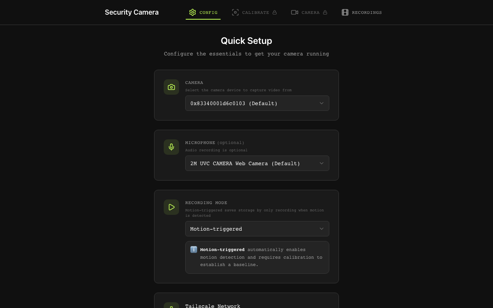
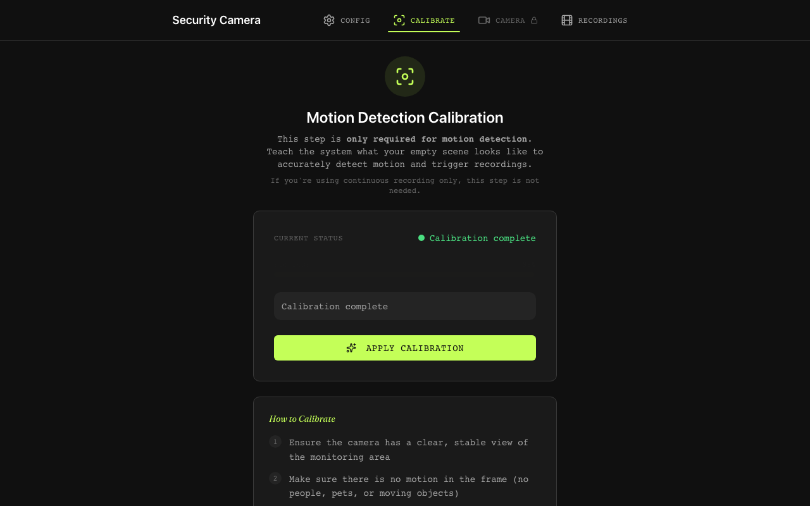
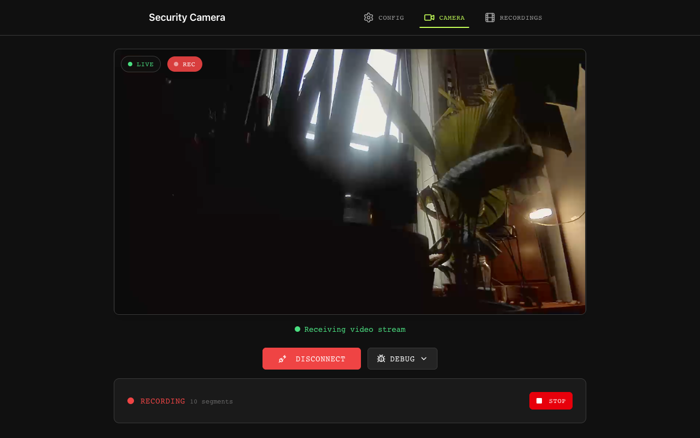
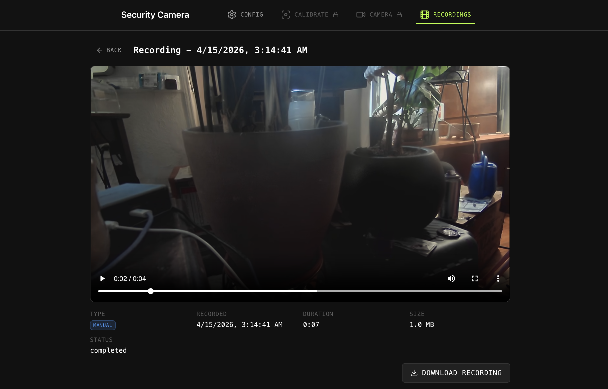
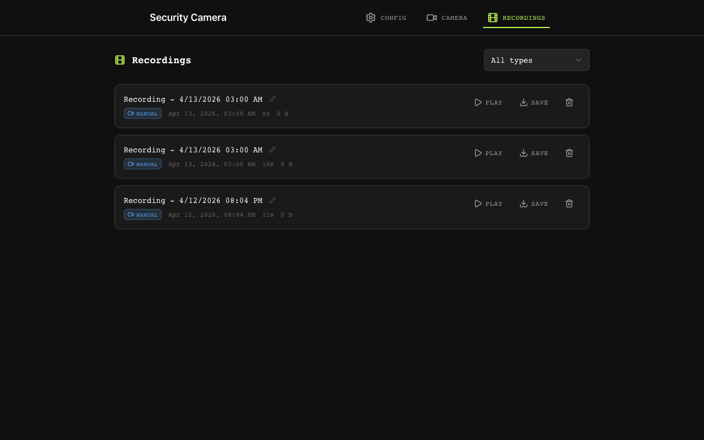
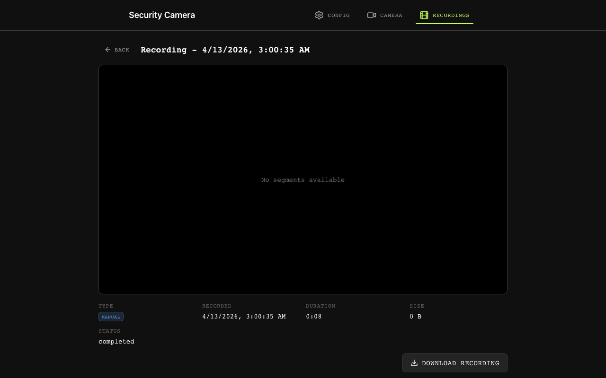

# webcam2

A self-hosted security camera system built with Go and React. Captures video from any USB/built-in camera, streams it live via WebRTC, detects motion with computer vision, and persists full-quality AV1 recordings to object storage.

## Why this exists

After a guest stole several expensive winter coats from my closet while I was away -- a theft I didn't discover until months later when it actually got cold -- I decided I needed real, ongoing security for my room. Not a Nest or Ring with a subscription. Not a toy app that records at 480p. Something that actually captures evidence.

I looked at the existing open-source options: [ZoneMinder](https://zoneminder.com/), [Frigate](https://frigate.video/), [motionEye](https://github.com/motioneye-project/motioneye), [Shinobi](https://shinobi.video/). They're all solid projects, but each had something that didn't fit: overly complex setup for a single-camera use case, tied to specific hardware, limited codec support, or lacking in the areas I cared about most (recording quality and network security). I also wanted an excuse to build something real with WebRTC and modern video codecs. So I built my own.

## Screenshots

> Generated automatically by Playwright ([`frontend/e2e/capture-screenshots.spec.ts`](frontend/e2e/capture-screenshots.spec.ts)). Re-run `cd frontend && npx playwright test e2e/capture-screenshots.spec.ts` after UI changes to refresh.

| Configuration | Calibration | Live View |
|:---:|:---:|:---:|
|  |  |  |

| Recording Controls | Recordings Browser | Playback |
|:---:|:---:|:---:|
|  |  |  |

## What it does

- **Live streaming** -- WebRTC via LiveKit SFU. H.264 hardware encoding (VideoToolbox on macOS). Sub-second latency on LAN.
- **Motion detection** -- Farneback optical flow via OpenCV/gocv. Calibrates to your scene automatically, then uses fixed thresholds for consistent detection.
- **Recording** -- AV1 encoding (SVT-AV1) into MKV containers. Every segment is independently playable. Crash-resilient: watchdog monitoring, orphan recovery on startup, fsync durability, panic recovery with best-effort finalization.
- **Storage** -- Segments upload to MinIO (S3-compatible). Metadata in PostgreSQL. SHA256 checksums. Configurable retention.
- **Networking** -- Tailscale mesh only, no TURN/STUN servers. If you're on the tailnet, you can watch. If you're not, you can't. Simple.
- **Browser UI** -- React + TypeScript. Three-tab wizard: configure, calibrate, watch. Browse and play back recordings. Start/stop recording manually.

## Architecture

```
                                     +---> Motion Detector (gocv/OpenCV)
                                     |     Farneback optical flow
                                     |     triggers recording on motion
                                     |
Camera --> FrameProducer --> FrameDistributor --+---> RecordingService --> GStreamer SVT-AV1
   (AVFoundation/V4L2)         (fan-out)       |     AV1 encode --> MKV mux (ebml-go)
                                               |     --> MinIO upload + PostgreSQL metadata
                                               |
                                               +---> GStreamer H.264 (VideoToolbox)
                                                     --> RTP packetization
                                                     --> LiveKit Publisher
                                                     --> livekit-server (SFU)
                                                     --> Browser (livekit-client JS SDK)
```

The key design decision: **recording and streaming are completely independent paths.** The camera produces raw frames once. A `FrameDistributor` fans them out to three consumers (motion, recording, streaming) via buffered channels. Recording quality is never degraded by network conditions because it never touches WebRTC.

### Why two codecs?

- **H.264** for live streaming -- hardware-accelerated, universally decoded by browsers, low latency
- **AV1** for recordings -- ~30% smaller files at equivalent quality, better for archival, worth the CPU cost when it's not real-time

### Why Tailscale?

No TURN servers, no STUN servers, no port forwarding, no Dynamic DNS. Tailscale gives every device a stable IP on a private mesh network. WebRTC ICE candidates resolve directly over the tailnet. This is a security camera -- the fewer network attack surfaces, the better.

## Tech stack

| Layer | Technology |
|---|---|
| Backend | Go 1.25 (53K lines across 130 files, 17 packages) |
| Frontend | React 19, TypeScript, Zustand, Tailwind CSS, Vite (5K lines) |
| WebRTC SFU | LiveKit (server + Go SDK + JS client SDK) |
| Video capture | pion/mediadevices (AVFoundation on macOS, V4L2 on Linux) |
| Streaming codec | H.264 via GStreamer + VideoToolbox |
| Recording codec | AV1 via GStreamer + SVT-AV1 |
| Container format | MKV via ebml-go |
| Motion detection | OpenCV via gocv -- Farneback optical flow |
| Object storage | MinIO (S3-compatible) |
| Metadata DB | PostgreSQL 15 |
| Credentials | AES-256-GCM encryption, Argon2id KDF, SQLite |
| Networking | Tailscale mesh (CGNAT range auth, WhoIs API) |
| Orchestration | Docker Compose (PostgreSQL, MinIO) + native processes |

## Project structure

```
webcam2/
|-- cmd/security-camera/        Entry point
|-- internal/
|   |-- api/                    HTTP API (10 handler files, rate limiting, CORS, Tailscale auth)
|   |-- calibration/            Motion baseline calibration (10s empty-scene recording)
|   |-- config/                 JSON config management + validation
|   |-- crypto/                 AES-256-GCM encryption with Argon2id key derivation
|   |-- database/               SQLite credential store
|   |-- framestream/            Fan-out frame distributor (buffered channels)
|   |-- integration/            Pipeline orchestration (wires producers to consumers)
|   |-- livekitPublisher/       LiveKit room connection + RTP track publishing
|   |-- motion/                 Optical flow detector (persistent Mat allocation, no GC pressure)
|   |-- recorder/
|   |   |-- buffer/             Frame buffers + emergency ring buffer fallback
|   |   |-- encoder/            GStreamer SVT-AV1 encoder interface
|   |   |-- pipeline/           Segment rotation, MKV muxing, keyframe forcing
|   |   |-- storage/            MinIO upload + PostgreSQL metadata + schema
|   |   `-- recorderlog/        Recording-specific structured logging
|   |-- tailscale/              WhoIs API integration for request authentication
|   |-- validate/               Input validation (password strength, config bounds)
|   `-- video/                  Camera + microphone capture
|-- frontend/src/
|   |-- components/             Config wizard, Calibration, Camera view, Recordings browser
|   |-- stores/                 Zustand state (config, calibration, connection, recordings)
|   |-- api/                    Axios API client
|   `-- types/                  Shared TypeScript types
|-- configs/livekit.yaml        LiveKit server config
|-- docker-compose.yml          PostgreSQL + MinIO
|-- start-all.sh                One-command startup (Docker + LiveKit + Node proxy + Go app)
`-- stop-all.sh                 Clean shutdown
```

## Getting started

### Prerequisites

- **Go 1.21+** and **Node.js 18+**
- **Docker** (for PostgreSQL and MinIO)
- **GStreamer** with plugins-base, plugins-good, and libav
- **OpenCV 4.x** (`brew install opencv` on macOS, `apt install libopencv-dev` on Linux)
- **LiveKit server** (`brew install livekit` or [download](https://github.com/livekit/livekit/releases))
- **Tailscale** ([install](https://tailscale.com/download))

### Run everything

```bash
git clone https://github.com/mikeyg42/webcam2.git
cd webcam2
./start-all.sh
```

This single script:
1. Starts Docker (if needed) and brings up PostgreSQL + MinIO
2. Finds an available port and starts livekit-server natively (not in Docker -- macOS Docker can't do bidirectional UDP for WebRTC ICE)
3. Builds the Go backend and React frontend
4. Starts the Node.js WebSocket proxy and the Go camera application
5. Prints all service URLs and tails the logs

Open **http://localhost:3000** and walk through the three tabs: configure your camera, run calibration, then go live.

### Development mode

```bash
# Build + run with debug logging
go build ./cmd/security-camera && ./security-camera -debug

# Headless testing (bypasses Tailscale auth)
WEBRTC_PASSWORD=testing123 WEBRTC_USERNAME=testuser ./security-camera -debug -headless -testing
```

## API

All endpoints require Tailscale authentication (except health check). The Go API runs on `:8081`, proxied through Node.js on `:3000`.

| Endpoint | Method | Purpose |
|---|---|---|
| `/api/config` | `GET` | Current configuration |
| `/api/config` | `POST` | Update configuration |
| `/api/calibration` | `POST` | Start motion calibration |
| `/api/calibration/status` | `GET` | Calibration progress |
| `/api/credentials` | `POST` | Store encrypted credentials |
| `/api/credentials` | `DELETE` | Delete credentials |
| `/api/credentials/status` | `GET` | Check credential state |
| `/api/livekit-token` | `GET` | JWT for WebRTC subscription |
| `/api/recording/start` | `POST` | Start recording |
| `/api/recording/stop` | `POST` | Stop recording |
| `/api/recording/status` | `GET` | Recording state |
| `/api/recordings` | `GET` | List recordings |
| `/api/recordings/{id}` | `GET` | Recording details |
| `/api/recordings/{id}` | `PATCH` | Update recording metadata |
| `/api/recordings/{id}` | `DELETE` | Delete recording |
| `/api/recordings/{id}/download` | `GET` | Download recording |
| `/api/recordings/{id}/segments/{index}/stream` | `GET` | Stream a segment |
| `/api/quality/metrics` | `GET` | WebRTC quality stats |
| `/api/recording/health` | `GET` | Recording pipeline health |
| `/api/health` | `GET` | Health check |

## Database schema

Three tables in PostgreSQL, auto-initialized from `internal/recorder/storage/schema.sql`:

- **`recordings`** -- One row per recording session. Tracks type (continuous/event), status, duration, storage location, video properties, and motion metadata.
- **`segments`** -- One row per MKV segment. Foreign-keyed to `recordings.external_id`. Tracks storage key, size, frame count, SHA256 checksum, upload status.
- **`motion_events`** -- One row per motion trigger. Confidence score, duration, peak confidence, frame count.

## Engineering decisions worth noting

**Crash resilience in the recording pipeline.** Recordings are the whole point of a security camera, so this is where I spent the most time hardening. The system handles: buffer overflow (emergency ring buffer fallback with adaptive drain rates), encoder stalls (watchdog with configurable thresholds), process crashes (orphaned file recovery on startup with MKV validation), power loss (periodic fsync + directory fsync before rename), and panics (best-effort finalization with `TryLock` to avoid deadlocks during recovery). Segment indices are monotonic and crash-persistent via database lookup, preventing object store key collisions after restart.

**Zero-copy RTP forwarding.** The LiveKit publisher uses `TrackLocalStaticRTP` to forward GStreamer's H.264 RTP packets directly to LiveKit without re-encoding or re-packetizing. GStreamer produces correctly packetized RTP; we just hand it off.

**Memory-conscious motion detection.** OpenCV Mats are allocated once at detector initialization and reused for every frame. No per-frame allocation, no GC pressure. The detector downsamples before computing optical flow to keep CPU usage reasonable.

**Rate limiting with bounded memory.** The credential API rate limiter caps at 10K tracked IPs to prevent memory exhaustion from distributed probes, while still providing meaningful per-IP throttling.

**Why LiveKit replaced ion-sfu.** The project originally used Pion's ion-sfu, but ion-sfu is pinned to pion/webrtc v3 and isn't actively maintained. LiveKit uses pion/webrtc v4 natively and is actively developed. The migration resolved dependency conflicts and gave us a production-grade SFU.

## Configuration

Runtime configuration lives at `~/.webcam2/config.json`. The browser UI writes to this file. Key sections:

- **Video** -- resolution, framerate, camera device
- **Audio** -- enable/disable, microphone device, sample rate
- **Motion** -- sensitivity, cooldown period, detection zones
- **Recording** -- format, segment duration, retention period, continuous vs. event-triggered
- **Storage** -- MinIO endpoint/credentials, PostgreSQL connection
- **Tailscale** -- node name, hostname

## License

MIT
